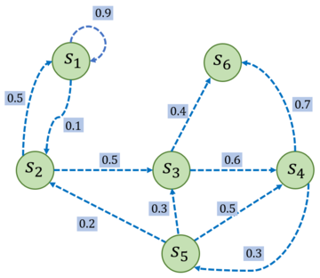

# 01 Preliminary Knowledge

## 1.1 Markov Decision Process

### 随机过程(Stochastic Process)
随机过程是指一系列随机变量的集合，这些随机变量的取值随时间而变化，并且这些随机变量的概率分布随时间而变化。令随机变量在时间 $t$ 时刻的取值为 $S_t$，则称 $S_t$ 为 $t$ 时刻的随机变量，所有随机变量的集合称为随机过程，记为 $\cal S$;在随机过程的某个时刻 $t$，随机变量/随机状态 $S_t$ 通常取决于$t$时刻之前的状态，即$P(S_{t+1}|S_1, S_2, \cdots, S_t)$。

### 马尔可夫性质(Markov Property)
当且仅当一个随机过程某时刻$t$的状态 $S_t$ 只依赖于 $t-1$ 时刻之前的状态时，这个随机过程被称为具有马尔可夫性质，用公式表示为：
$$
    P(S_{t+1}|S_t) = P(S_{t+1}|S_1, S_2, \cdots, S_t)
$$

**值得注意的是：一个随机过程具有马尔可夫性质并不代表这个随机过程就和历史完全没有关系。** 因为虽然$t+1$时刻的状态只依赖于$t$时刻之前的状态，但$t$时刻的状态可能依赖于$t-1$时刻之前的状态，以此类推，历史信息通过这种链式的关系被传递到当前时刻。

### 马尔可夫过程(Markov Process)
具有马尔可夫性质的随机过程被称为马尔可夫过程，也被称为马尔可夫链（Markov Chain）。令$\cal S$表示有限数量的状态集合，令$\cal P$表示状态转移矩阵，则马尔可夫过程可以用$(\cal S, \cal P)$来描述。其中：
  $$
      \cal S = \{s_1, s_2, \cdots, s_n\}
  $$
  $$
      \cal P = \begin{bmatrix}
          P_{11} & P_{12} & \cdots & P_{1n} \\
          P_{21} & P_{22} & \cdots & P_{2n} \\
          \vdots & \vdots & \ddots & \vdots \\
          P_{n1} & P_{n2} & \cdots & P_{nn}
      \end{bmatrix}
  $$
  其中，$P_{ij}$表示从状态$s_i$转移到状态$s_j$的概率，即$P(s_j|s_i)=P(S_{t+1}=s_j|S_t=s_i)$。
  另外，从某个状态出发，到达其他状态的概率和必须为1，即：
  $
      \sum_{j=1}^n P_{ij} = 1
  $

### 一个马尔可夫过程的例子
<center>

</center>

状态集合/空间：
$$
\cal S = (S_1, S_2, S_3, S_4, S_5, S_6)
$$
状态转移矩阵：
$$
\begin{bmatrix}
0.9 & 0.1 & 0 & 0 & 0 & 0 \\
0.5 & 0 & 0.5 & 0 & 0 & 0 \\
0 & 0 & 0 & 0.6 & 0 & 0.4 \\
0 & 0 & 0 & 0 & 0.3 & 0.7 \\
0 & 0.2 & 0.3 & 0.5 & 0 & 0 \\
0 & 0 & 0 & 0 & 0 & 1 \\
\end{bmatrix}
$$

**终止状态：** 不再转移到其他状态，即没有更多的动作可以选择(如示例中的状态$S_6$)。  
**状态采样：** 从某个状态出发，根据状态转移矩阵生成一个状态序列$\text{（Episode）}$的过程被称作状态采样$\text{(Sampling)}$。如状态采样（从$s_1$出发）：可以生成$s_1 \rightarrow s_2 \rightarrow s_3 \rightarrow s_6$或$s_1 \rightarrow s_1 \rightarrow s_2 \rightarrow s_3 \rightarrow s_4 \rightarrow s_6$等状态序列。

### 马尔可夫奖励过程(Markov Reward Process)
在马尔可夫过程基础上加入奖励函数$r$和折旧因子$\gamma$，即马尔可夫奖励过程（Markov Reward Process，MRP），用$(\cal S, \cal P, r, \gamma)$来表示，其中$\cal S$为状态空间，$\cal P$为状态转移概率矩阵，$r$为转移某个状态$s$时可以获得奖励的期望——记为$r(s)$——与状态有关，$\gamma$为折旧因子——取值范围$[0,1)$, 用于衡量未来收益的衰减程度。

**回报：** 从$t$时刻状态$S_t$开始，直到终止状态时，所有奖励的衰减值和称为回报，记为$G_t$，即：

$$
G_t = R_t + \gamma R_{t+1} + \gamma^2 R_{t+2} + \cdots =  \sum_{k=0}^{\infty}\gamma^k r(S_{t+k+1})
$$

### 一个马尔可夫奖励过程的例子
<center>

</center>

设$\gamma = 0.5$，状态采样得到一条状态序列为$s_1 \rightarrow s_2 \rightarrow s_3 \rightarrow s_6$，就可以计算$s_1$的回报$G_1$，得到：

$$
G_1 = r_1 + \gamma r_2 + \gamma^2 r_3 + \gamma^3 r_6 = -1 + 0.5 * (-2) + 0.5^2 * (-2) + 0.5^3 * 0 = -2.5
$$

### 马尔可夫决策过程(Markov Decision Process)
在马尔可夫奖励过程基础上引入智能体的动作，使得智能体能够在有限的时间内做出最优决策，通常使用$\langle \cal S,\cal A,\cal P,r,\gamma\rangle$来表示马尔可夫决策过程。

- $\cal S$是状态空间
- $\cal A$是动作空间
- $\cal P(s'|s,a)$是状态转移函数，表示在状态$s$执行动作$a$后到达状态$s'$的概率
- $r(s,a)$是奖励函数，奖励取同时取决于状态$s$和动作$a$
- $\gamma$是折旧因子

**简言之，马尔可夫决策过程是一种引入智能体动作的马尔可夫奖励过程（在奖励函数和转移函数上加入了智能体的动作），马尔可夫奖励过程是一种引入奖励函数和折旧因子的马尔可夫过程，马尔可夫过程是一种具备马尔可夫性质的随机过程。**

### 一个马尔可夫决策过程的例子
<center>

</center>

在这个例子中有五个状态，分别为$S_1, S_2, S_3, S_4, S_5$；例子中有七个动作，分别为保持$S_1$、前往$S_1$、前往$S_2$、前往$S_3$、前往$S_4$、前往$S_5$、概率前往。

### 马尔可夫决策过程转化为马尔可夫奖励过程

使用**边缘化**的方法将MDP转化为MRP。对于某一个状态，对所有动作的概率进行加权求和，得到一个关于奖励的边缘分布，就可以认为是一个MRP在该状态下的奖励，即：

$$r'(s) = \sum_{a \in A} \pi(a|s) r(s,a)$$
同理，计算采取动作的概率使状态$s$转移到$s'$的概率的乘积后求和，得到一个关于转移的边缘分布，就可以认为是一个MRP在状态$s$到$s'$的转移分布，即：

$$P'(s'|s) = \sum_{a \in A} \pi(a|s) P(s'|s,a)$$

这样，MDP就可以转化为MRP: $\langle \cal S,\cal P',r',\gamma\rangle$

### 代码示例


```python
import numpy as np
```


```python
# 状态空间
S = ['s1', 's2', 's3', 's4', 's5']

# 动作空间
A = ['保持s1', '前往s1', '前往s2','前往s3', '前往s4','前往s5', '概率前往']

# 状态转移函数
P = {
    's1->保持s1-s1': 1.,
    's1->前往s2-s2': 1.,
    's2->前往s1-s1': 1.,
    's2->前往s3-s3': 1.,
    's3->前往s4-s4': 1.,
    's3->前往s5-s5': 1.,
    's4->保持s5-s5': 1.,
    's4->概率前往-s2': 0.2,
    's4->概率前往-s3': 0.4,
    's4->概率前往-s4': 0.4
}

# 奖励函数
R = {
    's1->保持s1': -1,
    's1->前往s2': 0,
    's2->前往s1': -1,
    's2->前往s3': -2,
    's3->前往s4': -2,
    's3->前往s5': 0,
    's4->保持s5': 10,
    's4->概率前往': 1
}
```


```python
# 定义马尔可夫决策过程
gamma = 0.5

MDP = (S, A, P, R, gamma)
```


```python
# 策略
Pi = {
    's1->保持s1': 0.5,
    's1->前往s2': 0.5,
    's2->前往s1': 0.5,
    's2->前往s3': 0.5,
    's3->前往s4': 0.5,
    's3->前往s5': 0.5,
    's4->保持s5': 0.5,
    's4->概率前往': 0.5
}

# 转换后的状态转移矩阵: Pi & P -> P'
mdp2mrp_p = np.array([
    [0.5, 0.5, 0, 0, 0],
    [0.5, 0, 0.5, 0, 0],
    [0, 0, 0, 0.5, 0.5],
    [0, 0.1, 0.2, 0.2, 0.5],
    [0, 0, 0, 0, 1.0]
])

# 转换后的奖励矩阵: Pi & R -> R'
mdp2mrp_r = [-0.5, -1.5, -1.0, 5.5, 0]
```
